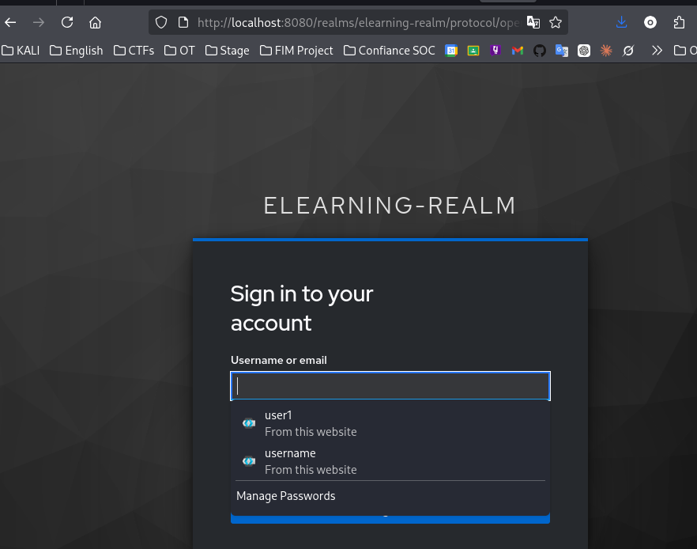
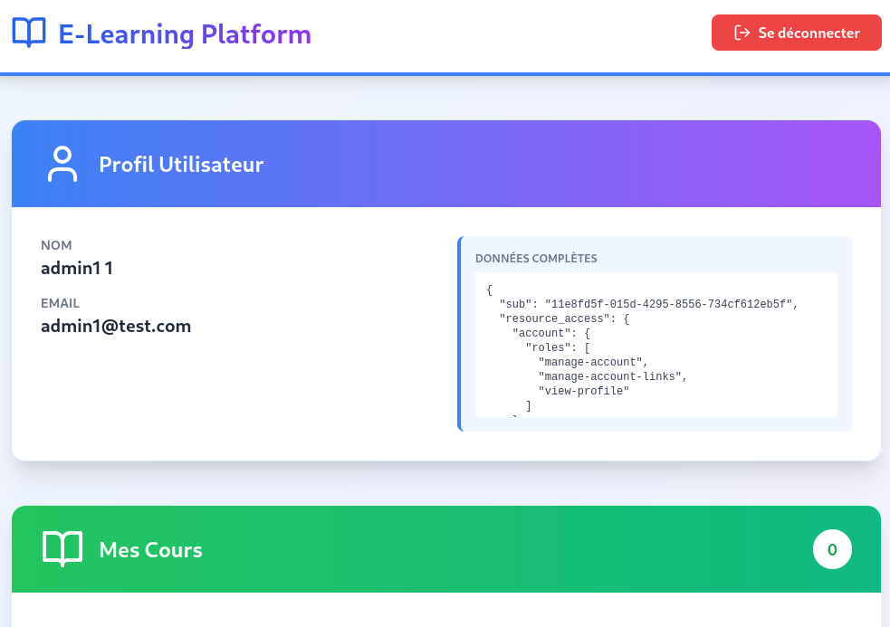

README — Présentation du travail réalisé
=======================================

Objectif du document
--------------------
Ce fichier présente de manière concise et professionnelle le travail effectué dans le projet "Application E-Learning" : nouveautés apportées au frontend, architecture générale, flux de communication entre les composants, aperçu des résultats (captures d'écran) et indications de démarrage minimales.

**1. Résumé du travail réalisé**
---------------------------
- Frontend : refonte de l'interface React/Vite avec intégration de Tailwind CSS et d'icônes (lucide-react). Ajout d'états de chargement, gestion d'erreurs visibles, layout responsive et cards pour les cours.
- Backend : application Spring Boot protégée par OAuth2 (Keycloak). Endpoints exposés : `/me` et `/courses` (protégés par JWT).
- Authentification : usage de Keycloak (realm `elearning-realm`, client `react-client`) avec flux PKCE pour la SPA et rafraîchissement automatique du token.
- Documentation : ajout de documents techniques et guides (`ARCHITECTURE.md`, `EXPLICATION_TECHNIQUE.md`, `DESIGN_SYSTEM.md`, `HELP.md`, `QUICKSTART.md`, etc.).

**2. Architecture générale**
------------------------
Schéma simplifié :

```
┌──────────────────────────────┐       HTTPS      ┌──────────────────────────┐
│        Navigateur (SPA)      │  ───────────────► │        Backend API       │
│  React + Keycloak JS (Vite)  │  Authorization:   │  Spring Boot (Resource   │
│  - UI Tailwind               │  Bearer <JWT>     │  Server, /me, /courses)  │
└───────┬──────────────────────┘                   └─────────┬────────────────┘
        │                                                ▲
        │                                                │
        │   OAuth2 / OpenID Connect                      │
        │   (redirects, tokens)                          │
        ▼                                                │
┌──────────────────────────────┐                         │
│        Keycloak (Auth)       │─────────────────────────┘
│        (port 8080)           │
│  - Realm: elearning-realm    │
│  - Client: react-client      │
└──────────────────────────────┘
```

Composants et ports par défaut
- Frontend (Vite) : détecte et affiche l'URL locale (ex. `http://localhost:5173` ou `http://localhost:3000`).
- Keycloak : `http://localhost:8080`.
- Backend Spring Boot : `http://localhost:8081` (vérifier `application.properties`).


---

### Structure du Projet

#### Frontend (`/frontend`)

```
frontend/
├── src/
│   ├── App.jsx                 # Composant principal (Tailwind + Lucide)
│   ├── main.jsx                # Point d'entrée React
│   ├── index.css               # Styles Tailwind
│   ├── keycloak.js             # Configuration Keycloak JS
│   └── keycloak/               # Dossier keycloak (config)
├── public/
│   └── vite.svg                # Assets publics
├── index.html                  # HTML template
├── package.json                # Dépendances npm
├── vite.config.js              # Configuration Vite
├── tailwind.config.js          # Configuration Tailwind CSS
└── postcss.config.js           # Configuration PostCSS
```

#### Backend (`/src/main/java`)

```
src/main/java/ccn/elkadiri/applicationelearning/
├── ApplicationELearningApplication.java    # Spring Boot App
├── SecurityConfig.java                     # Configuration OAuth2
└── ElearningController.java                # Endpoints REST
```

**3. Flux de communication détaillé**
--------------------------------
1. L'utilisateur ouvre la SPA dans le navigateur.
2. La SPA initialise Keycloak JS (`keycloak.init({ onLoad: 'login-required', pkceMethod: 'S256' })`). Si non authentifié, l'utilisateur est redirigé vers Keycloak.
3. L'utilisateur s'authentifie sur Keycloak ; Keycloak renvoie un token (JWT) à la SPA.
4. La SPA stocke le token en session Keycloak et l'utilise pour appeler les endpoints backend en ajoutant l'en-tête `Authorization: Bearer <TOKEN>`.
5. Le backend Spring Boot valide le JWT (issuer / jwk-set-uri pointant sur Keycloak) puis sert les ressources demandées (`/me`, `/courses`).
6. La SPA gère le rafraîchissement automatique du token via `keycloak.updateToken(...)` ; si le rafraîchissement échoue, l'utilisateur est redirigé pour se réauthentifier.

Points de sécurité
- Les JWT sont validés côté backend via Spring Security OAuth2 Resource Server.
- En développement, `checkLoginIframe: false` est souvent utilisé pour éviter des problèmes d'iframe.
- En production, toujours utiliser HTTPS et vérifier les CORS/Origins autorisés dans la configuration Spring Security.

**4. Aperçu des résultats (captures d'écran)**
------------------------------------------
Les captures d'écran suivantes se trouvent dans le dossier `./Démo` (relatif à la racine du projet). Vous pouvez les insérer dans une documentation ou un rapport en utilisant les chemins indiqués.

- Interface principale après authentification (version 1)


- Redirection vers Keycloak (version 1)



- Interface principale après authentification (version 2)



**5. Démarrage minimal (commandes rapides)**
----------------------------------------
1) Démarrer Keycloak (Docker, recommandé) :

```bash
docker run --rm -e KEYCLOAK_ADMIN=admin -e KEYCLOAK_ADMIN_PASSWORD=admin -p 8080:8080 quay.io/keycloak/keycloak:26.0.0 start-dev
```

2) Démarrer le backend (depuis la racine du projet) :

```bash
./mvnw spring-boot:run
```

3) Démarrer le frontend (nouveau terminal) :

```bash
cd frontend
npm install
npm run dev
```

4) Ouvrir l'URL indiquée par Vite (ex. `http://localhost:5173` ou `http://localhost:3000`) et se connecter via Keycloak.

**6. Observations et points d'amélioration**
----------------------------------------
- Préparer un pipeline CI/CD (build frontend + copy dans `static/` + packager backend).
- Activer HTTPS pour les environnements de pré-production et production.
- Ajouter des tests end-to-end (Cypress) pour couvrir le flux d'authentification et l'affichage des cours.

Fin du document
--------------

